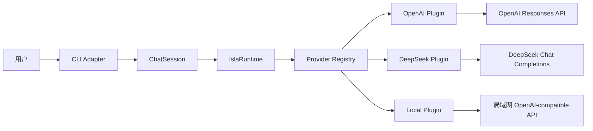

# Isla v0 架构设计

状态：待实现  
日期：2026-09-08  
执行者：Luna  
设计目标：以最少代码验证一个可演化、插件化、跨模型的个人 Agent Runtime。

## 1. 设计结论

v0 只回答一个问题：

> Isla 能否在 CLI 中建立一次进程内会话，通过启动时选定的 Provider 连续对话，并保持核心不依赖任何厂商协议？

只要这个闭环可以稳定运行、自动测试、构建和打包，v0 即完成。v0 不是完整 Agent，也不为尚未出现的需求预建框架。

## 2. 核心原则

1. **核心拥有协议，插件提供能力。** Runtime 定义内部消息和 Provider 契约，OpenAI、DeepSeek、本地服务负责协议转换。
2. **插件化不等于万物皆插件。** v0 只有 Model Provider 一种扩展能力。
3. **会话属于 Isla。** 历史由 ChatSession 在进程内维护，不依赖某个厂商的服务端会话 ID。
4. **部署不进入核心。** 同一套代码可以在 Windows、macOS ARM64、Linux x64 原生运行，未来也可包装成容器。
5. **模型所见必须可重建。** user 消息在调用 Provider 前进入历史；只有有效回答才写入 assistant 消息。调用失败不会抹去用户已经表达的意图，也不会制造 assistant 消息。
6. **配置与代码分离。** Provider、模型、地址、超时和密钥都来自运行环境。
7. **默认测试完全离线。** 自动测试不得调用真实付费 API。
8. **只添加当前用得上的抽象。** 不增加 DI、Event Bus、中间件管线、Repository、Controller 或多包结构。

## 3. 技术基线

| 项目 | 选择 | 理由 |
|---|---|---|
| Runtime | Node.js 24 LTS | 当前 LTS，支持 Windows、macOS 和 Linux |
| 语言 | TypeScript strict | 明确核心契约，降低 Provider 协议泄漏风险 |
| 模块 | ESM | 使用现代 `import` / `export` |
| 包管理 | npm + package-lock.json | Node 自带，部署和公开发布路径最短 |
| 开发运行 | tsx | 无需先构建即可运行 TypeScript CLI |
| 构建 | tsc | 不引入额外 bundler |
| 测试 | Vitest | 适合 TypeScript 与异步测试 |
| HTTP 模拟 | MSW 2 | 在网络边界拦截 SDK 请求，不模拟 SDK 内部实现 |
| 厂商 SDK | openai | OpenAI 官方客户端；DeepSeek 与本地兼容接口复用其 HTTP 客户端能力 |
| License | MIT | 公开、简单、适合个人工具 |

`package.json` 的 Node 约束使用 `>=24`，不锁死补丁版本；实际安装结果由 `package-lock.json` 固定。

### 3.1 TypeScript 编译原则

建议关键配置：

```json
{
  "compilerOptions": {
    "target": "ES2023",
    "module": "NodeNext",
    "moduleResolution": "NodeNext",
    "strict": true,
    "rootDir": "src",
    "outDir": "dist",
    "sourceMap": true,
    "noUncheckedIndexedAccess": true,
    "exactOptionalPropertyTypes": true
  }
}
```

源码中的本地 ESM import 使用最终输出对应的 `.js` 扩展名，例如：

```ts
import { IslaRuntime } from "./core/runtime.js";
```

## 4. 系统边界



### 4.1 Runtime 核心负责

- 安装 RuntimePlugin。
- 防止重复插件名和重复 Provider ID。
- 保存已注册 Provider。
- 根据 Provider ID 创建 ChatSession。
- 不解析厂商 API 响应。
- 不直接读取环境变量。
- 不输出终端文字。

### 4.2 ChatSession 负责

- 固定本会话的 Provider。
- 保存本次进程内的消息历史。
- 先记录新输入，再由当前历史组成一次 ModelRequest。
- 调用 Provider。
- 成功后提交 assistant 消息。
- 失败时保留 user 消息，不提交 assistant 消息。

### 4.3 CLI 负责

- 读取配置并组装 Runtime。
- 安装选定的 Provider 插件。
- 建立一轮 readline 交互循环。
- 显示 `you>` 与 `isla>`。
- 支持 `/exit` 和 Ctrl+C 退出。
- 捕获最外层错误并显示一条可理解的信息。
- 不保存会话、不处理模型协议。

### 4.4 Provider 插件负责

- 创建并持有对应 SDK Client。
- 将 Isla Message 转换成厂商请求。
- 调用配置的模型与 API 地址。
- 将厂商响应转换成统一 ModelResponse。
- 不保存会话历史。
- 不直接写终端。

## 5. 建议目录

```text
Isla/
├── src/
│   ├── cli.ts
│   ├── config.ts
│   ├── main.ts
│   ├── core/
│   │   ├── types.ts
│   │   ├── plugin.ts
│   │   ├── runtime.ts
│   │   └── session.ts
│   └── providers/
│       ├── openai.ts
│       ├── deepseek.ts
│       └── local.ts
├── tests/
│   ├── core/
│   ├── providers/
│   └── support/
│       ├── fake-provider.ts
│       └── mock-server.ts
├── docs/
├── .github/
│   └── workflows/
│       └── ci.yml
├── .env.example
├── .gitignore
├── LICENSE
├── package.json
├── package-lock.json
├── tsconfig.json
├── vitest.config.ts
└── README.md
```

保持单 package。`core` 与 `providers` 是唯一领域目录，不再增加 `services`、`managers` 或 `utils` 垃圾桶目录。

## 6. 核心契约

以下为设计契约，不要求逐字照搬命名，但实现不得改变其职责边界。

```ts
export type MessageRole = "system" | "user" | "assistant";

export interface Message {
  readonly role: MessageRole;
  readonly content: string;
}

export interface ModelRequest {
  readonly messages: readonly Message[];
}

export interface TokenUsage {
  readonly input?: number;
  readonly output?: number;
  readonly total?: number;
}

export interface ModelResponse {
  readonly text: string;
  readonly model?: string;
  readonly usage?: TokenUsage;
}

export interface ModelProvider {
  readonly id: string;
  readonly model: string;
  generate(request: ModelRequest): Promise<ModelResponse>;
}
```

插件契约：

```ts
export interface PluginContext {
  registerProvider(provider: ModelProvider): void;
}

export interface RuntimePlugin {
  readonly name: string;
  setup(context: PluginContext): void;
}
```

Runtime 外部接口：

```ts
export interface CreateSessionOptions {
  readonly providerId: string;
  readonly systemPrompt?: string;
}

export class IslaRuntime {
  use(plugin: RuntimePlugin): this;
  createSession(options: CreateSessionOptions): ChatSession;
}

export class ChatSession {
  send(input: string): Promise<ModelResponse>;
}
```

### 6.1 有意不提供的接口

v0 不提供：

- `switchProvider()` 或 `switchModel()`。
- 公共 Service Locator。
- 任意字符串服务注册。
- 插件动态扫描、卸载和热重载。
- Provider 之间互相查找。
- 会话的文件序列化。
- 原始厂商响应透传。
- 公共事件总线。

## 7. 插件注册流程

启动过程固定为：

```text
读取 AppConfig
  → 创建 IslaRuntime
  → 根据配置创建一个 Provider Plugin
  → runtime.use(plugin)
  → runtime.createSession(...)
  → 启动 CLI 循环
```

Provider 插件使用工厂函数创建：

```ts
runtime.use(createOpenAIPlugin(config));
```

或者：

```ts
runtime.use(createDeepSeekPlugin(config));
```

一次启动只安装用户选择的模型插件即可。测试可以安装 FakeProvider；核心允许注册多个 Provider，但 CLI v0 不暴露运行时切换能力。

## 8. 会话语义

### 8.1 历史范围

- 会话开始时可选加入一条 system 消息。
- 每轮请求发送当前会话全部历史。
- 暂时不做 token 计算、摘要、窗口裁剪或遗忘。
- CLI 退出时历史自然消失。

“保留部分上下文”在 v0 中表示只保留本次进程会话，不代表只保留最近 N 轮。真正的 Context 策略在出现上下文长度问题后单独设计。

### 8.2 消息提交顺序

收到用户输入 `U2` 时，先将它提交到会话：

```text
[System?, U1, A1, U2]
```

再从当前会话历史构造请求并调用 Provider。Provider 成功返回 `A2` 后，只追加 assistant 消息：

```text
[System?, U1, A1, U2, A2]
```

如果 Provider 失败，会话保留已经表达的用户意图：

```text
[System?, U1, A1, U2]
```

下一次输入例如“再试一次”时，模型可以看到失败请求前后的语义。v0 不额外写入 error 消息；错误只反馈给 CLI。这个顺序满足一条长期不变量：凡是实际发送给模型的对话消息，都能由 Isla 当前会话状态重建。

### 8.3 并发

CLI v0 串行等待每次回答，不支持同一 Session 并发调用，因此不增加锁、队列或请求调度器。

## 9. Provider 设计

### 9.1 OpenAIProvider

- API：Responses API。
- Endpoint：OpenAI SDK 默认地址。
- 输入：将完整 Isla 消息映射到 Responses `input`。
- 输出：读取 `response.output_text`。
- 不使用 `previous_response_id`；上下文由 Isla 管理。
- Client 设置 `maxRetries: 0`，避免 SDK 默认重试产生隐藏的重复调用。

### 9.2 DeepSeekProvider

- API：Chat Completions。
- Endpoint：`https://api.deepseek.com`。
- Client：OpenAI SDK 配置 DeepSeek `baseURL` 与 Key。
- 输入：直接转换为兼容的 `messages`。
- 输出：读取首个 choice 的 message content。
- v0 不加入 DeepSeek 独有 thinking 参数；只有现实需求出现时再扩展能力配置。
- Client 设置 `maxRetries: 0`。

### 9.3 LocalProvider

- API：OpenAI-compatible Chat Completions。
- Endpoint：用户提供的 `ISLA_BASE_URL`。
- 兼容目标：Ollama、LM Studio、MLX-LM 等常见本地 HTTP 服务的共同最小子集。
- API Key 可选；SDK 必须要求字符串时使用内部占位值，不将占位值当作真实秘密。
- 不探测服务品牌，不根据 URL 猜测能力。
- 不负责启动、停止或下载本地模型。
- Client 设置 `maxRetries: 0`。

## 10. 配置设计

v0 只读取环境变量，不引入配置文件框架。

通用变量：

| 变量 | 必填 | 说明 |
|---|---:|---|
| `ISLA_PROVIDER` | 是 | `openai`、`deepseek` 或 `local` |
| `ISLA_MODEL` | 是 | 当前会话模型名称 |
| `ISLA_SYSTEM_PROMPT` | 否 | 本次会话 system prompt |
| `ISLA_TIMEOUT_MS` | 否 | 单次请求超时，默认 600000 毫秒 |
| `ISLA_DEBUG` | 否 | 设为 `1` 或 `true` 启用 stderr 开发诊断，不记录会话内容 |

Provider 变量：

| Provider | 变量 | 必填 |
|---|---|---:|
| OpenAI | `OPENAI_API_KEY` | 是 |
| DeepSeek | `DEEPSEEK_API_KEY` | 是 |
| Local | `ISLA_BASE_URL` | 是 |
| Local | `ISLA_API_KEY` | 否 |

配置优先级在 v0 不做多层覆盖：只有进程环境变量。开发脚本可以借助 Node 的 env-file 能力载入项目根目录 `.env`，但 Runtime 不自行搜索用户目录。

`.env.example` 只允许空值和注释：

```env
ISLA_PROVIDER=
ISLA_MODEL=
ISLA_SYSTEM_PROMPT=
ISLA_TIMEOUT_MS=600000
OPENAI_API_KEY=
DEEPSEEK_API_KEY=
ISLA_BASE_URL=
ISLA_API_KEY=
```

### 10.1 配置错误

配置在发出网络请求前一次性验证：

- Provider 不是三个允许值：停止启动。
- 缺少模型名：停止启动。
- 云 Provider 缺少对应 Key：停止启动。
- Local 缺少 Base URL 或 URL 无效：停止启动。
- 超时不是正整数：停止启动。

不用 Zod，不建立错误类继承树。抛出带明确文本的普通 `Error`，CLI 统一显示；启动配置错误返回非零退出码，会话请求错误显示一次后继续循环。

## 11. CLI 行为

预期交互：

```text
Isla v0 · provider=openai · model=<configured-model>
输入 /exit 或按 Ctrl+C 退出。

you> 你好
isla> 你好，有什么可以帮你？

you> 你还记得我刚才说了什么吗？
isla> 记得，你刚才向我问好。
```

规则：

- 空行直接进入下一次输入。
- `/exit` 精确匹配后退出。
- 不增加 `/model`、`/provider`、`/clear`、历史保存等命令。
- 请求期间串行等待，不接收第二条输入。
- 请求失败只显示一次错误，然后允许用户继续提问。
- 不打印 API Key、完整请求对象或 SDK 原始响应。
- 不使用颜色库和 CLI 框架。

为了自动测试，CLI 主循环实现为可传入 Node `Readable` 与 `Writable` 的函数，生产入口默认传入 `process.stdin`、`process.stdout` 和 `process.stderr`。这是一个由测试和未来入口复用共同驱动的边界，不增加新的 Adapter 层级。

## 12. 错误与请求策略

- 只在 CLI 最外层捕获未知错误。
- Provider 可以补充 `providerId` 后重新抛出，但不建立多级错误体系。
- OpenAI SDK 默认会重试部分网络错误和 408、409、429、5xx；v0 显式设置 `maxRetries: 0`。
- 统一请求超时默认 10 分钟，允许通过 `ISLA_TIMEOUT_MS` 调整，以兼容较慢的本地模型。
- v0 不自动重试、不回退到其他 Provider、不切换模型。
- Ctrl+C 直接结束进程；v0 不实现优雅取消协议。

## 13. 日志与隐私

v0 不引入日志框架。`ISLA_DEBUG=1` 或 `true` 时，CLI 在 stderr 输出一行不含密钥、请求内容和响应内容的诊断信息，包含 provider、model、错误类型和 `timeout`、`network` 或 `provider` 分类；默认不输出诊断信息。

允许输出：

- Provider ID。
- 模型名。
- 简洁错误信息。
- 测试结果和构建结果。

默认禁止输出或保存：

- API Key 和 Authorization Header。
- 完整环境变量。
- 完整请求或原始响应对象。
- 用户提问和模型回答到文件。
- 私人会话内容到 CI artifact。

## 14. 自动测试

### 14.1 核心单元测试

使用 FakeProvider，不经过网络：

1. 插件可以注册 Provider。
2. 重复插件名被拒绝。
3. 重复 Provider ID 被拒绝。
4. 找不到 Provider 时无法创建 Session。
5. 首轮请求包含 system 与 user 消息。
6. 第二轮请求包含前一轮 user/assistant 与新 user。
7. Provider 成功后追加 assistant 消息。
8. Provider 失败后保留 user 消息且不追加 assistant 消息。
9. 失败后的下一轮请求包含上次 user 消息与本轮新输入。
10. Session 始终使用创建时指定的 Provider。

FakeProvider 自己保存收到的请求，测试通过观察契约输入验证历史，不为生产 Session 增加测试专用 getter。

### 14.2 Provider 契约测试

使用 MSW 在 Node 进程内拦截真实 SDK 发出的 HTTP 请求：

- OpenAI：断言调用 `/responses`、模型名正确、输入包含完整历史，并返回模拟 `output_text`。
- DeepSeek：断言调用 `/chat/completions`、Authorization 存在但不记录值、消息顺序正确。
- Local：断言使用自定义 Base URL、模型名正确、无真实 Key 也能组装请求。
- 三者分别覆盖非 2xx、无文本响应和网络错误。

MSW 配置 `onUnhandledRequest: "error"`，测试结束后重置 handler，避免请求意外访问互联网。

### 14.3 CLI 测试

使用内存 Readable/Writable：

- 输入 `你好\n/exit\n`，断言包含一次 `isla>` 回答。
- 输入空行不会调用 Provider。
- Provider 一次失败后仍可接收下一次输入。
- `/exit` 不调用 Provider。

### 14.4 配置测试

- 三种 Provider 的最小有效配置。
- 必填变量缺失。
- 非法 Provider。
- 非法 Base URL。
- 非法超时。

每个测试恢复原环境变量，避免互相污染。

### 14.5 真实 API Smoke Test

真实 OpenAI、DeepSeek、本地服务测试与默认测试分离：

```text
npm test                 永远离线
npm run test:smoke       明确执行，可能联网和产生费用
```

`npm run check` 不包含 smoke test。GitHub CI 不配置个人 API Key，也不运行 smoke test。

## 15. npm Scripts

设计目标：每个命令只有一个清晰职责。

```json
{
  "scripts": {
    "dev": "tsx --env-file-if-exists=.env src/cli.ts",
    "build": "tsc -p tsconfig.json",
    "start": "node --env-file-if-exists=.env dist/cli.js",
    "typecheck": "tsc -p tsconfig.json --noEmit",
    "test": "vitest run",
    "test:watch": "vitest",
    "test:smoke": "vitest run tests/smoke",
    "check": "npm run typecheck && npm run test",
    "pack:check": "npm pack --dry-run"
  }
}
```

如果 `tsx` 不支持透传该 Node 参数，Luna 应保持同样行为，改用最小等价写法，不增加 dotenv 依赖，除非验证表明确有必要。

## 16. GitHub CI 与发布

### 16.1 v0 CI

任何 push 和 pull request 执行：

```text
npm ci
npm run check
npm run build
npm run pack:check
```

建议矩阵：

- `ubuntu-latest`
- `windows-latest`
- `macos-latest`
- Node 24

CI 不需要秘密信息。所有 Provider 测试由 MSW 拦截。

### 16.2 发布原则

- v0 实现阶段不自动发布 npm。
- 首先验证 `npm pack` 产物只包含 `dist`、README、LICENSE 和必要 package metadata。
- 稳定后再添加基于 Git tag 的公共 npm 发布工作流。
- 发布凭据应使用 npm/GitHub 支持的安全发布机制，不写进仓库。
- 包名暂定 `@winc159/isla`，实施前确认 npm scope 可用。

## 17. 原生部署边界

v0 只保证：

```text
npm install -g <package>
isla
```

后续常驻运行分别使用：

- Linux：用户级 systemd。
- macOS：LaunchAgent。

服务定义不进入 v0。等 Isla 出现非交互式 `serve` 模式后再设计，否则让 systemd 常驻一个交互式 CLI 没有意义。

## 18. v0 明确不做

- 流式输出。
- 历史持久化。
- Context 裁剪、摘要和遗忘。
- 长期记忆与知识库。
- Tool calling。
- 搜索。
- 多 Agent。
- Stable/Candidate 自我升级。
- Provider 自动探测。
- Provider 故障转移。
- 会话中切换模型。
- Web UI、HTTP Server、IM 接入。
- Dockerfile、systemd、LaunchAgent。
- 动态第三方插件安装。
- 日志框架、遥测和数据库。

## 19. v0 完成标准

同时满足以下条件才算完成：

1. Windows 上可以运行源码 CLI。
2. CLI 可以连续进行至少两轮有上下文对话。
3. OpenAI、DeepSeek、本地 Provider 均实现同一 ModelProvider 契约。
4. 会话中不能切换 Provider 或模型。
5. Provider 失败后保留 user 消息、不写入 assistant 消息，下一轮可以重建完整模型输入。
6. 默认测试完全离线且能阻止意外网络请求。
7. `npm run check`、`npm run build`、`npm run pack:check` 全部通过。
8. GitHub CI 在 Windows、Linux、macOS 上通过。
9. `npm pack` 中不包含 `.env`、测试数据、私人信息或源码外的无关文件。
10. README 能指导用户配置任一 Provider 并开始连续对话。
