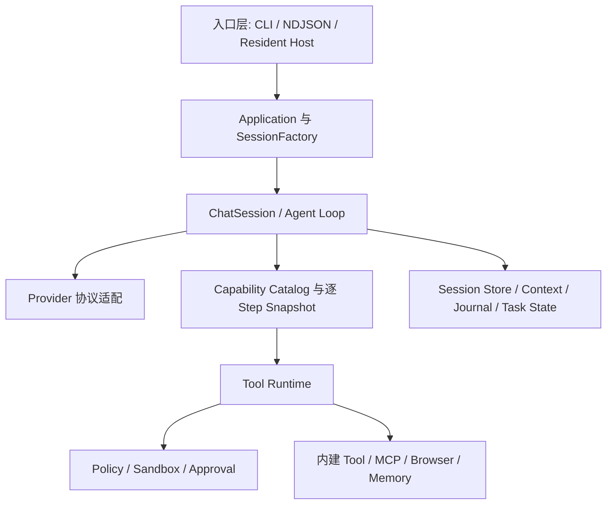
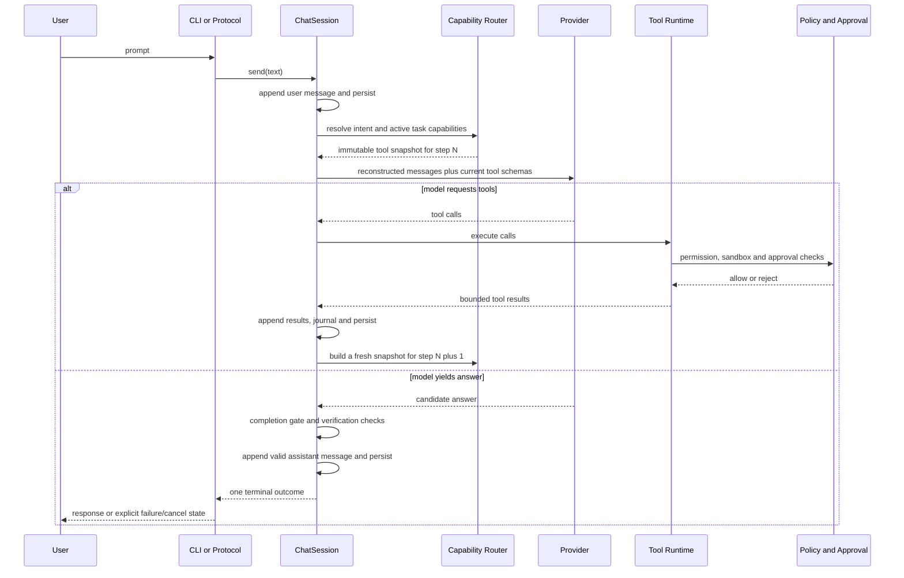
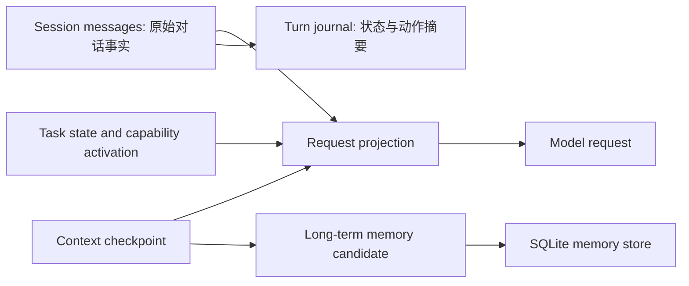

# Isla 当前架构

本文以 `0.4.8` 源码为事实源，描述 CLI Agent Runtime 的稳定边界。

## 产品定位与原则

Isla 是面向个人使用的 TypeScript/Node.js Agent Runtime。当前主要入口是 CLI，同时提供 NDJSON 协议和只监听 loopback 的 Resident Host。它不是通用 Agent 平台：能力只在现实需求出现后扩展，Provider、模型和部署方式不会渗透进 Runtime Core。

核心原则：

- Config/Profile 是正常运行的配置事实源；`.env` 只用于显式开发、CI 或迁移兼容。
- Provider 表示协议适配，模型、Base URL 与凭据属于 Profile 连接配置。
- 用户消息在调用模型前写入会话；只有有效模型回答进入 assistant 历史。
- 原始 Session 是事实，Context 压缩只改变模型输入投影。
- Capability 激活只决定工具可见性，不代表批准执行，也不能绕过 Policy、Sandbox 或 Approval。
- CLI、NDJSON 和 Host 复用同一个 Application、SessionFactory 与 Runtime。

## Runtime 分层

依赖方向由入口向核心和端口适配器流动。`src/core/` 不拥有 CLI、HTTP、Playwright 或具体 Provider 的生命周期；装配集中在 `src/main.ts`、`src/application.ts` 和 `src/session-factory.ts`。

## 核心模块职责

| 模块 | 职责 |
|---|---|
| `src/main.ts` | 解析启动参数，优先加载 Config/Profile，创建 Provider 与 MCP Host 并注册到 Runtime。 |
| `src/cli.ts` | TTY 文本循环、命令分发、取消、显示和 NDJSON 启动装配。 |
| `src/application.ts` | 聚合 Runtime、Session Store、Memory、诊断与关闭生命周期。 |
| `src/session-factory.ts` | 按 workspace 和当前会话组装 Session、能力目录、Browser、MCP、Memory 与持久化回调。 |
| `src/core/session.ts` | 会话事实、Agent Loop、请求投影、工具轮次、完成门禁、压缩、终态与持久化。 |
| `src/core/model-step.ts` | 单次 Provider 调用、流式/非流式选择、重试事件与候选结果。 |
| `src/capability-catalog.ts` | Host-owned manifest、可用性、检索与能力 Provider。 |
| `src/capability-routing.ts` | 确定性预选、Task 激活状态、逐 Model Step Tool Snapshot 和能力元工具。 |
| `src/tools/` | Tool 契约、组合、执行、权限分类及内建能力。 |
| `src/mcp/` | Profile 配置的 stdio MCP Server 生命周期、目录映射、调用与诊断。 |
| `src/browser/` | Playwright 会话、URL 策略、人工接管 Console 与凭据批准。 |
| `src/memory/` | SQLite 长期记忆、Core Memory、检索、可选 Embedding 与检查点候选。 |
| `src/session-store.ts` | JSON Session schema、兼容迁移与原子持久化。 |
| `src/protocol/` | stdin/stdout NDJSON 请求、事件、Approval 与用户问题。 |
| `src/sandbox/`、`src/approval/` | workspace 路径边界、敏感文件拒绝、操作权限和用户批准。 |

## 用户请求完整链路

用户输入先成为 Session 事实，因此实际发给模型的消息可以从会话重建。Provider 错误、取消、空回答或被完成门禁拒绝的候选不会伪装成成功的 assistant 消息。

## Capability 与 Tool

SessionFactory 将内建 `ToolCapability`、Profile 已配置的 MCP 能力和 Browser 能力注册到 `CapabilityCatalog`。Manifest 提供稳定 ID、摘要、关键词、风险、生命周期和需求；Catalog 负责可发现性，不执行工具。

每个任务保存 `CapabilityActivationStateV1`。Runtime 根据用户输入、已有激活状态和必须包含的元能力做确定性预选；页面内容等不可信指令不能触发非只读能力。模型也可调用：

- `capability_search`：只搜索摘要；
- `capability_activate`：激活已知且可用的能力，从下一 Model Step 生效；
- `capability_status`：查看可用、拒绝和激活状态。

每个 Model Step 都重新生成不可变 Snapshot。只有 Snapshot 中能力的 Tool Definition 会发给模型。激活后实际调用仍经过 Tool Runtime 的工具查找、权限分类、Sandbox、Approval、取消和结果规范化。

## Session、Context、Journal 与 Memory

- Session Store 保存消息、Context、Journal、Task State、Skill Catalog 与 Capability Activation；workspace key 隔离发现和恢复。
- Context 在预算压力下裁剪可重新获取的旧 Tool 结果，并为闭合旧轮次生成 checkpoint；不删除原始 Session 消息。
- Journal 保存回合、模型尝试、工具动作、检查点和终态的结构化摘要，不以私人正文替代 Session。
- Memory 是独立持久层；检索失败可降级，不得让记忆不可用破坏基本对话闭环。

## Provider 边界

`IslaRuntime` 注册 OpenAI、DeepSeek、Bailian 和 OpenAI-compatible local Provider。Provider 接收统一 ModelRequest，声明 tool calling、native streaming 与 streaming tool calls 等能力，并把平台响应映射为统一结果。一次进程启动后 Provider 和模型保持固定；模型切换写入 Profile 后下次启动生效。

## MCP 与 Browser 边界

MCP Host 只消费 Profile 显式配置的本地 stdio Server。外部 description、schema、instructions 和结果都视为不可信；稳定限定名、目录预算、Profile allow/deny 和 Tool Runtime 继续生效。当前不支持远程 transport、OAuth、resources、prompts、热重载或在线安装。

Browser 使用隔离的 Playwright 上下文和 URL Policy。Browser Console 仅监听 loopback，用于人工接管；凭据使用需要独立批准，明文不进入模型、Session、Tool Result 或普通日志。Browser 能力不等于任意网络或任意 JavaScript 权限。

## 安全与审批

安全控制是串联关系而不是互相替代：

1. Profile 决定能力和 MCP 的配置边界；
2. Capability Policy 决定可发现和可暴露的范围；
3. Tool Runtime 根据 permission 执行或发起 Approval；
4. Sandbox 将文件读写限制在 workspace，并拒绝敏感路径；
5. 外部研究完成门禁要求真实成功的 Web Search、Web Fetch 或 Browser 读取证据，HTTP 非 2xx 不计为证据；
6. Journal 和诊断只记录安全摘要，秘密与原始私人内容不得进入日志。

## 部署边界

原生 Node.js、容器、systemd 或 launchd 只负责进程托管。Runtime Core 不感知部署环境。Resident Host 仅绑定 loopback、使用 Bearer token、限制并发回合并在关闭时取消和收敛活动会话；它不是公网或多用户服务。

## 当前明确不支持

- Web UI、公网 Host、多用户和 Job 队列；
- 运行期间动态切换 Provider/Model；
- 在线插件安装、任意代码动态加载和热更新；
- MCP 远程 transport、OAuth、resources、prompts 和 tasks；
- Embedding 或独立模型驱动的能力路由；
- 并行 Tool、Subagent 和通用 Workflow 框架；
- 自动修改、部署或演化自身。

## 架构修改约束

新增抽象必须由现实需求驱动；入口应复用 Application、SessionFactory 和核心契约；新能力必须声明配置、风险、权限、取消、持久化、协议和测试边界。若修改模型输入、Session 事实、终态、Approval 或 Sandbox 契约，必须先更新设计决策并取得确认。
